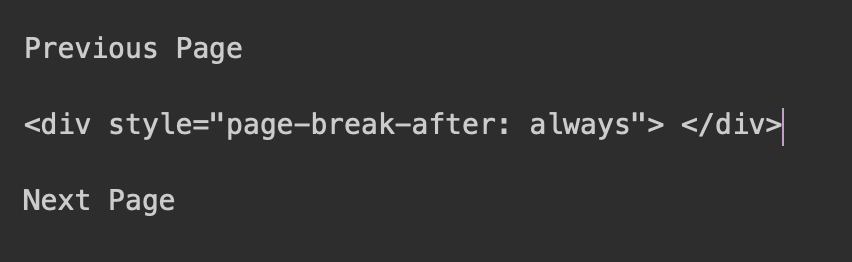

# Alfred-Markdown-Page-Break

## Page Break in Markdown

You can use `
 
` to break the page when you convert your **.md** file to **.pdf** and etc.

But it would be **NIGHTMARE** to type the code **EVERYTIME**!!!

## Usage

Enter `pb`, then press **Enter** to paste it on the most front App.

## Example

### Use

### Before

### After

